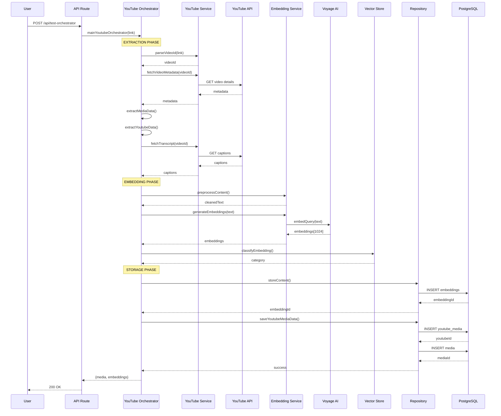
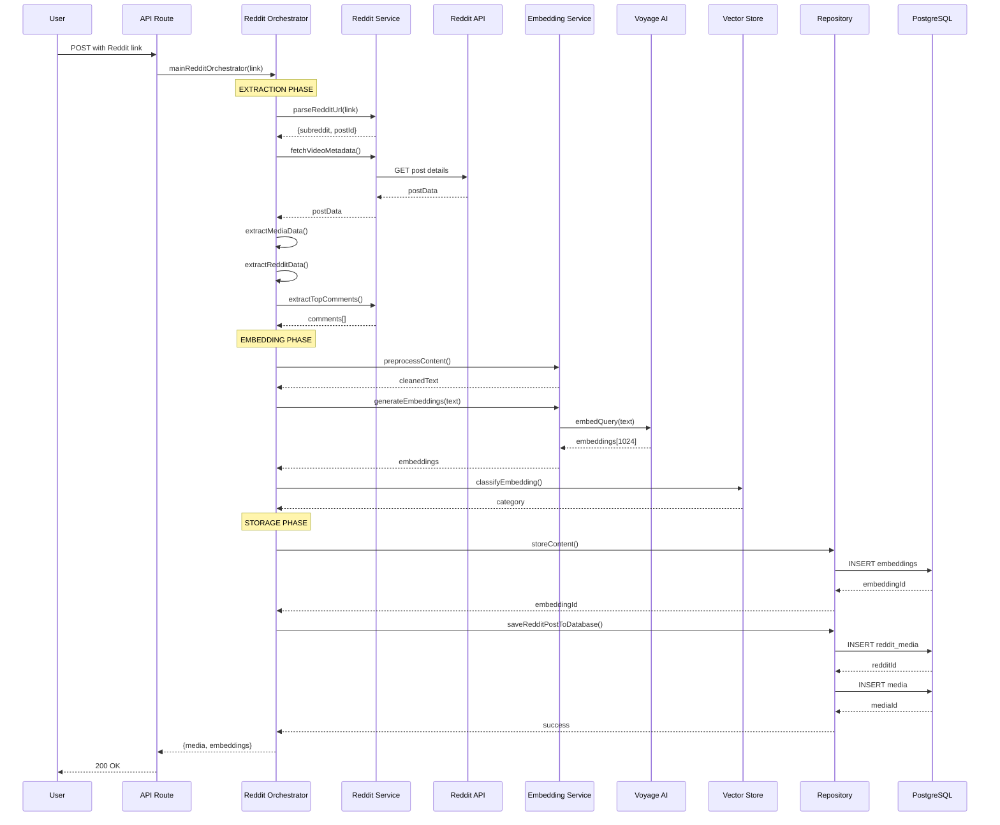
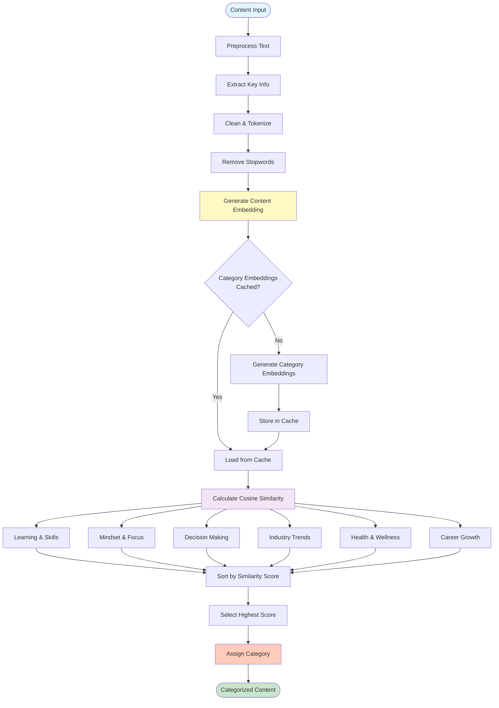
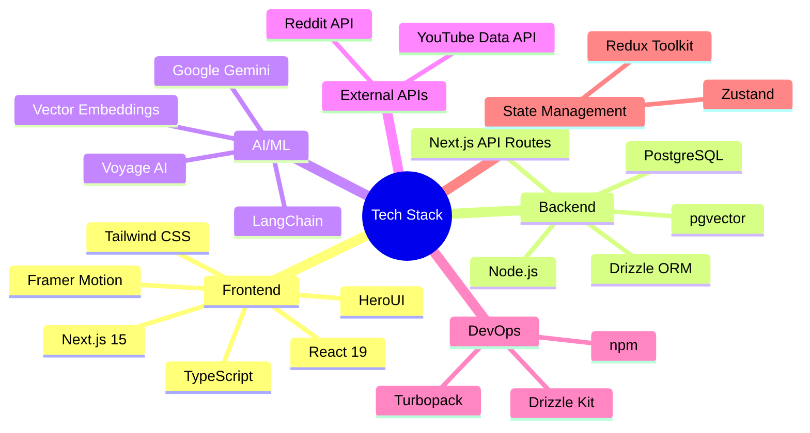
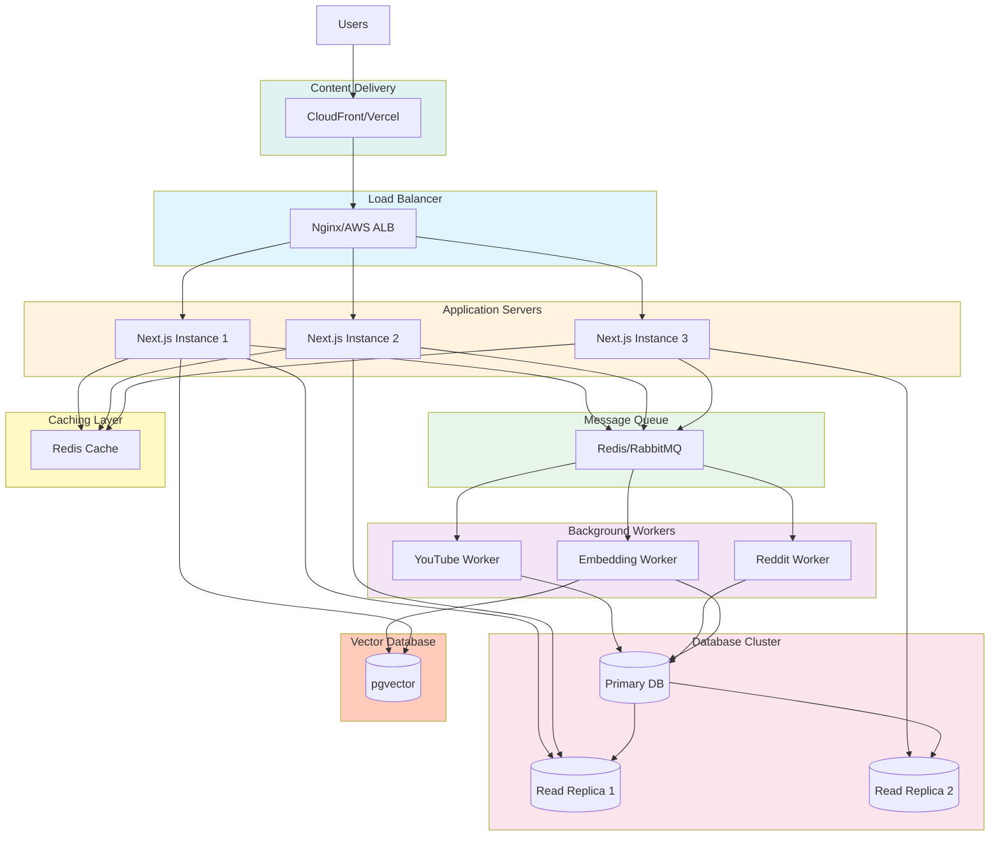
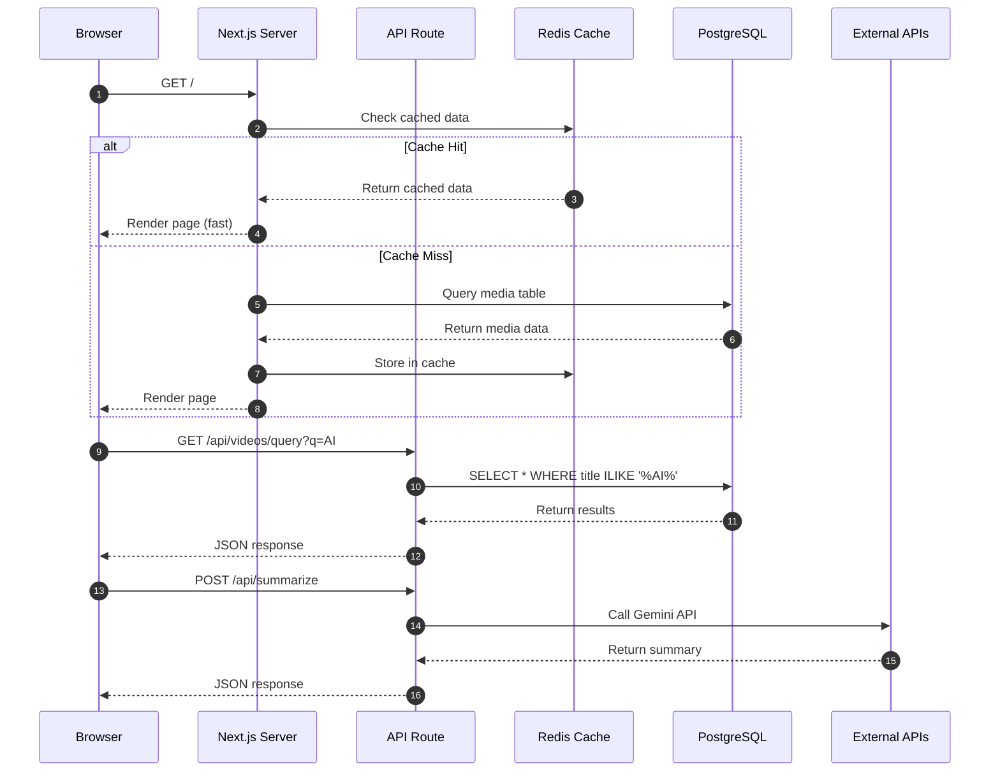
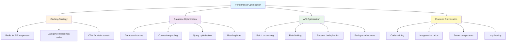
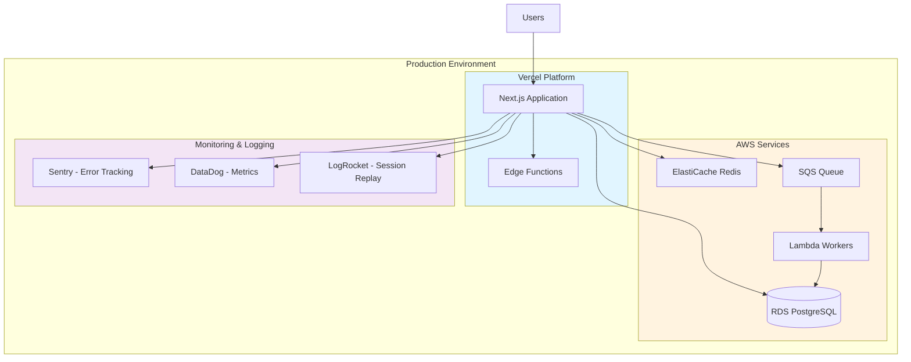

# System Architecture Diagrams

## 🏗️ Complete System Architecture

```mermaid
graph TB
    subgraph Client["🖥️ CLIENT LAYER"]
        UI[Next.js Frontend]
        SSR[Server-Side Rendering]
        Pages[React Pages & Components]
    end

    subgraph API["🔌 API LAYER - REST Endpoints"]
        Videos["/api/videos<br/>GET - List All"]
        VideoID["/api/videos/[id]<br/>GET - Single Video"]
        Query["/api/videos/query<br/>GET - Search"]
        Category["/api/videos/category<br/>GET - Filter"]
        Summarize["/api/summarize<br/>POST - AI Summary"]
        TestOrch["/api/test-orchestrator<br/>GET - Test Pipeline"]
    end

    subgraph Orchestration["🎯 ORCHESTRATION LAYER"]
        YTO[YouTube Orchestrator]
        RDO[Reddit Orchestrator]
        
        subgraph YTOFlow["YouTube Pipeline"]
            YTO1[1. Extract Metadata]
            YTO2[2. Fetch Captions]
            YTO3[3. Generate Embeddings]
            YTO4[4. Classify Category]
            YTO5[5. Store Data]
        end
        
        subgraph RDOFlow["Reddit Pipeline"]
            RDO1[1. Extract Post Data]
            RDO2[2. Fetch Comments]
            RDO3[3. Generate Embeddings]
            RDO4[4. Classify Category]
            RDO5[5. Store Data]
        end
    end

    subgraph Services["⚙️ SERVICE LAYER"]
        subgraph Platform["Platform Services"]
            YTS[YouTube API Service]
            RDS[Reddit API Service]
            YTM[YouTube Metadata Service]
            RDM[Reddit Metadata Service]
            YTT[YouTube Transcript Service]
        end
        
        subgraph Vector["Vector Services"]
            EmbedGen[Embedding Service]
            Preproc[Preprocessing Service]
            Cache[Cache Service]
        end
        
        subgraph Content["Content Services"]
            VectorStore[Vector Store Service]
            Summary[Summary Service]
        end
    end

    subgraph Repository["💾 REPOSITORY LAYER"]
        YTRepo[YouTube Media Repository]
        RDRepo[Reddit Media Repository]
        EmbedRepo[Embedding Repository]
    end

    subgraph Database["🗄️ DATABASE LAYER"]
        subgraph PostgreSQL["PostgreSQL + pgvector"]
            MediaTable[(media table)]
            YTTable[(youtube_media table)]
            RDTable[(reddit_media table)]
            EmbedTable[(media_embeddings table)]
        end
    end

    subgraph External["🌐 EXTERNAL SERVICES"]
        YouTubeAPI[YouTube Data API v3]
        RedditAPI[Reddit API]
        VoyageAPI[Voyage AI - Embeddings]
        GeminiAPI[Google Gemini - LLM]
    end

    %% Client to API connections
    UI --> Videos
    UI --> VideoID
    UI --> Query
    UI --> Category
    UI --> Summarize
    
    %% API to Orchestration
    Videos --> YTO
    Videos --> RDO
    TestOrch --> YTO
    Summarize --> Summary
    
    %% Orchestration to Services
    YTO --> YTS
    YTO --> YTM
    YTO --> YTT
    YTO --> EmbedGen
    YTO --> Preproc
    YTO --> VectorStore
    
    RDO --> RDS
    RDO --> RDM
    RDO --> EmbedGen
    RDO --> Preproc
    RDO --> VectorStore
    
    %% Services to External APIs
    YTS --> YouTubeAPI
    RDS --> RedditAPI
    EmbedGen --> VoyageAPI
    Summary --> GeminiAPI
    
    %% Orchestration to Repository
    YTO --> YTRepo
    YTO --> EmbedRepo
    RDO --> RDRepo
    RDO --> EmbedRepo
    
    %% Repository to Database
    YTRepo --> MediaTable
    YTRepo --> YTTable
    YTRepo --> EmbedTable
    
    RDRepo --> MediaTable
    RDRepo --> RDTable
    RDRepo --> EmbedTable
    
    EmbedRepo --> EmbedTable
    
    %% Styling
    classDef clientStyle fill:#e1f5ff,stroke:#01579b,stroke-width:2px
    classDef apiStyle fill:#fff3e0,stroke:#e65100,stroke-width:2px
    classDef orchStyle fill:#f3e5f5,stroke:#4a148c,stroke-width:2px
    classDef serviceStyle fill:#e8f5e9,stroke:#1b5e20,stroke-width:2px
    classDef repoStyle fill:#fff9c4,stroke:#f57f17,stroke-width:2px
    classDef dbStyle fill:#fce4ec,stroke:#880e4f,stroke-width:2px
    classDef externalStyle fill:#e0f2f1,stroke:#004d40,stroke-width:2px
    
    class UI,SSR,Pages clientStyle
    class Videos,VideoID,Query,Category,Summarize,TestOrch apiStyle
    class YTO,RDO,YTO1,YTO2,YTO3,YTO4,YTO5,RDO1,RDO2,RDO3,RDO4,RDO5 orchStyle
    class YTS,RDS,YTM,RDM,YTT,EmbedGen,Preproc,Cache,VectorStore,Summary serviceStyle
    class YTRepo,RDRepo,EmbedRepo repoStyle
    class MediaTable,YTTable,RDTable,EmbedTable dbStyle
    class YouTubeAPI,RedditAPI,VoyageAPI,GeminiAPI externalStyle`
``

---

## 📊 Database Schema (ERD)

```mermaid
erDiagram
    media ||--o| youtube_media : "has"
    media ||--o| reddit_media : "has"
    media ||--o| media_embeddings : "has"
    
    media {
        int id PK
        enum type "short|image|video|photo"
        varchar platform "youtube|reddit"
        varchar thumbnail_url
        varchar post_url
        text title
        int duration_ms
        varchar post_id
        text category
        timestamp created_at
        timestamp updated_at
        int reddit_id FK
        int youtube_id FK
        int embedding_id FK
    }
    
    youtube_media {
        int id PK
        text description
        varchar definition
        jsonb english_captions
    }
    
    reddit_media {
        int id PK
        text subreddit
        text author
        varchar post_link
        jsonb comments
    }
    
    media_embeddings {
        int id PK
        text content
        vector embedding "1024 dimensions"
    }
```

---

## 🔄 Data Flow - YouTube Processing



---

## 🔄 Data Flow - Reddit Processing



---

## 🎯 Category Classification Flow



---

## 🏛️ Layered Architecture

```mermaid
graph LR
    subgraph Layer1["Presentation Layer"]
        A1[React Components]
        A2[Pages]
        A3[SSR]
    end
    
    subgraph Layer2["API Layer"]
        B1[REST Endpoints]
        B2[Request Validation]
        B3[Response Formatting]
    end
    
    subgraph Layer3["Orchestration Layer"]
        C1[YouTube Orchestrator]
        C2[Reddit Orchestrator]
        C3[Workflow Coordination]
    end
    
    subgraph Layer4["Service Layer"]
        D1[Platform Services]
        D2[Vector Services]
        D3[Content Services]
    end
    
    subgraph Layer5["Repository Layer"]
        E1[Data Access]
        E2[Query Building]
        E3[Transaction Management]
    end
    
    subgraph Layer6["Database Layer"]
        F1[(PostgreSQL)]
        F2[(pgvector)]
    end
    
    Layer1 --> Layer2
    Layer2 --> Layer3
    Layer3 --> Layer4
    Layer4 --> Layer5
    Layer5 --> Layer6
    
    style Layer1 fill:#e1f5ff
    style Layer2 fill:#fff3e0
    style Layer3 fill:#f3e5f5
    style Layer4 fill:#e8f5e9
    style Layer5 fill:#fff9c4
    style Layer6 fill:#fce4ec
```



---

## 🔐 Technology Stack Diagram



---

## 📈 Scalability Architecture (Future)



---

## 🔄 Request Flow Example



---

## 📊 Performance Optimization Strategy



---

## 🎯 Key Architectural Patterns

### 1. **Orchestrator Pattern**
- Coordinates complex workflows
- Manages service dependencies
- Centralizes error handling
- Provides transaction boundaries

### 2. **Repository Pattern**
- Abstracts data access
- Enables testing with mocks
- Centralizes query logic
- Maintains separation of concerns

### 3. **Service Layer Pattern**
- Encapsulates business logic
- Promotes reusability
- Enables independent testing
- Facilitates microservices migration

### 4. **Layered Architecture**
- Clear separation of concerns
- Unidirectional dependencies
- Easy to understand and maintain
- Supports scalability

---

## 🚀 Deployment Architecture (Recommended)



---

## 📝 Summary

This architecture demonstrates:

✅ **Clean Separation of Concerns** - Each layer has a specific responsibility
✅ **Scalability** - Can scale horizontally with load balancers and workers
✅ **Maintainability** - Modular design makes changes easier
✅ **Testability** - Each component can be tested independently
✅ **Performance** - Caching, indexing, and optimization strategies
✅ **Modern Stack** - Latest technologies and best practices
✅ **AI Integration** - Sophisticated ML pipeline for content classification
✅ **Type Safety** - Full TypeScript coverage across all layers

This is a **production-ready architecture** that can handle real-world traffic and scale as needed.
