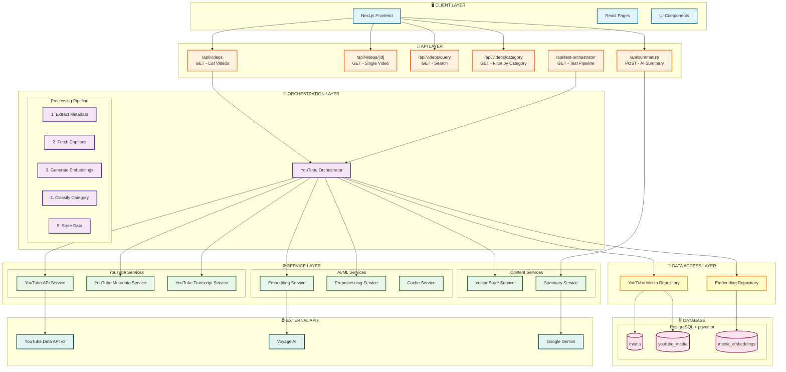
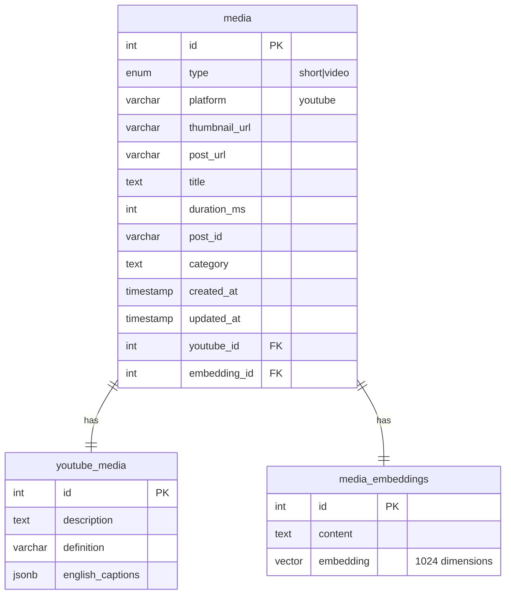
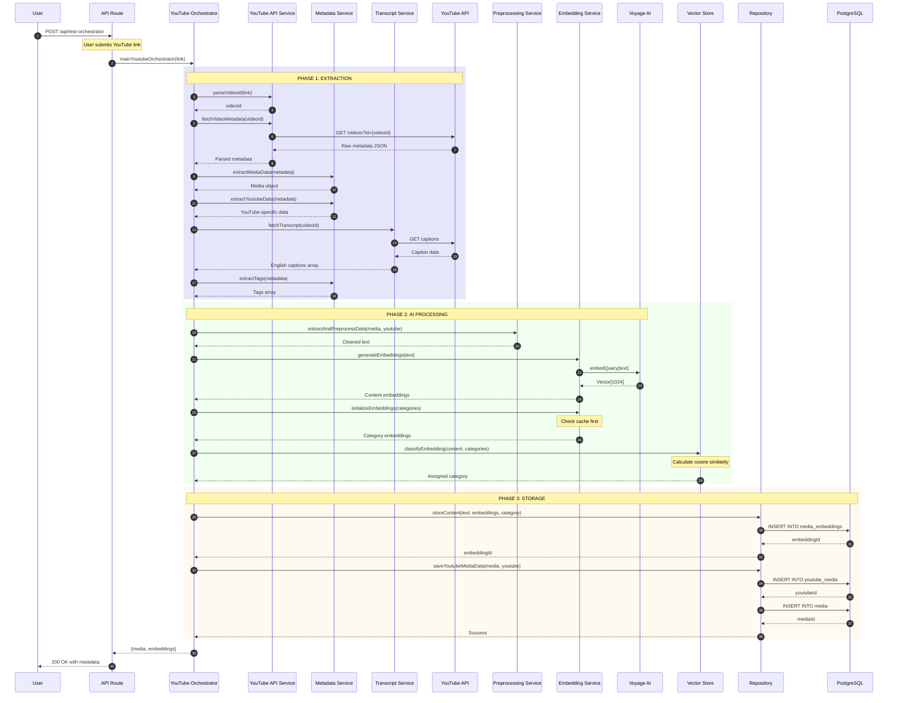
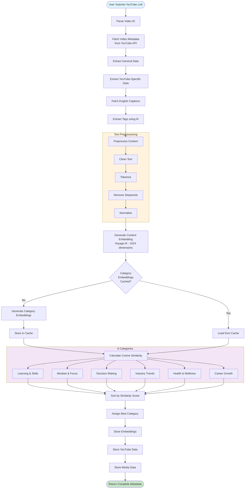
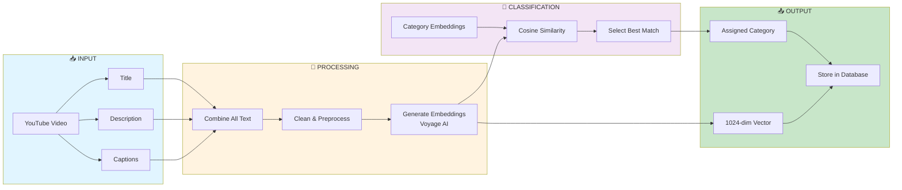
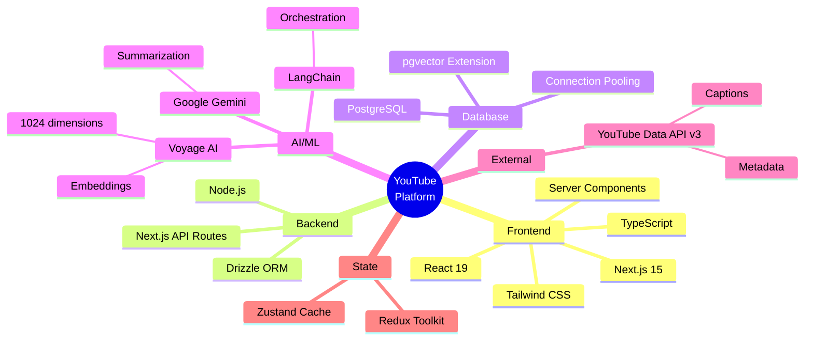
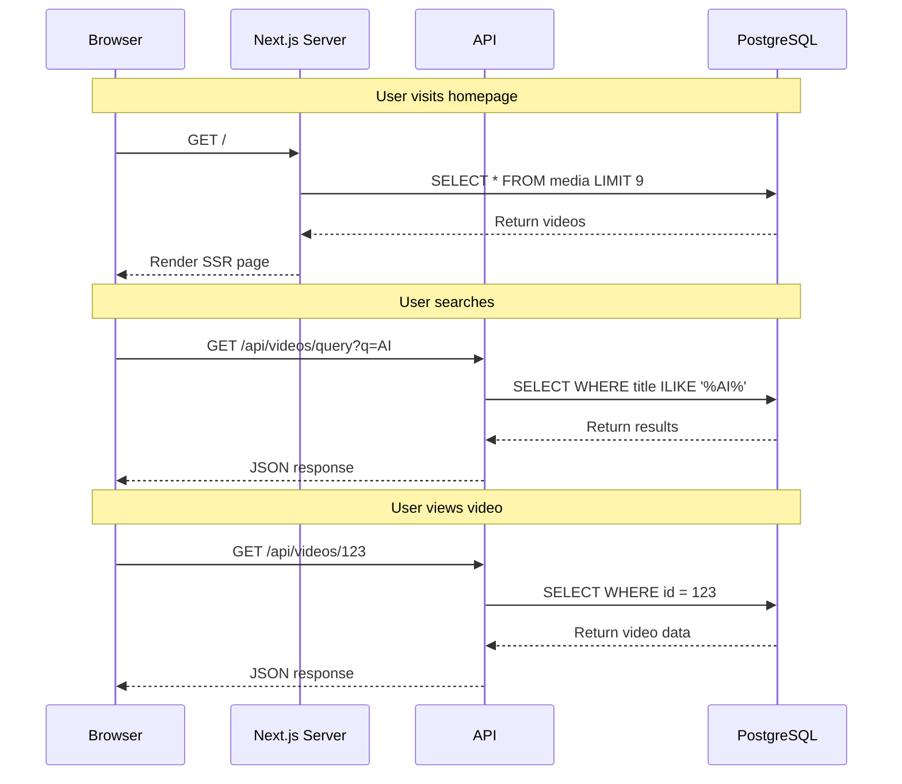
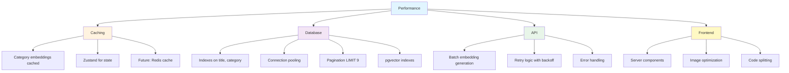

# YouTube Content Processing Architecture

## 🎯 System Overview

A Next.js full-stack application that fetches YouTube videos, processes their content using AI embeddings, automatically categorizes them, and provides a searchable interface.

---

## 🏗️ Complete System Architecture



---

## 📊 Database Schema



---

## 🔄 Complete Data Flow



---

## 🎯 YouTube Processing Pipeline



---

## 🏛️ Layered Architecture

```mermaid
graph TB
    subgraph Layer1["📱 PRESENTATION LAYER"]
        direction LR
        L1A[Home Page<br/>Server-Side Rendered]
        L1B[Video Detail Page]
        L1C[Category Pages]
        L1D[Search Interface]
    end
    
    subgraph Layer2["🔌 API LAYER"]
        direction LR
        L2A[GET /api/videos]
        L2B[GET /api/videos/id]
        L2C[GET /api/videos/query]
        L2D[POST /api/summarize]
    end
    
    subgraph Layer3["🎯 ORCHESTRATION LAYER"]
        direction LR
        L3A[YouTube Orchestrator]
        L3B[Workflow Coordination]
        L3C[Error Handling]
    end
    
    subgraph Layer4["⚙️ SERVICE LAYER"]
        direction LR
        L4A[YouTube Services]
        L4B[Embedding Services]
        L4C[Vector Services]
        L4D[Content Services]
    end
    
    subgraph Layer5["💾 REPOSITORY LAYER"]
        direction LR
        L5A[YouTube Repository]
        L5B[Embedding Repository]
        L5C[Query Building]
    end
    
    subgraph Layer6["🗄️ DATABASE LAYER"]
        direction LR
        L6A[(media)]
        L6B[(youtube_media)]
        L6C[(embeddings)]
    end
    
    Layer1 --> Layer2
    Layer2 --> Layer3
    Layer3 --> Layer4
    Layer4 --> Layer5
    Layer5 --> Layer6
    
    style Layer1 fill:#e1f5ff,stroke:#01579b,stroke-width:2px
    style Layer2 fill:#fff3e0,stroke:#e65100,stroke-width:2px
    style Layer3 fill:#f3e5f5,stroke:#4a148c,stroke-width:2px
    style Layer4 fill:#e8f5e9,stroke:#1b5e20,stroke-width:2px
    style Layer5 fill:#fff9c4,stroke:#f57f17,stroke-width:2px
    style Layer6 fill:#fce4ec,stroke:#880e4f,stroke-width:2px
```



---

## 🧠 AI/ML Pipeline



---

## 🔐 Technology Stack



---

## 📈 API Endpoints

### **GET /api/videos**
```typescript
// Fetch all videos with pagination
Response: {
  body: Media[],
  status: 200
}
```

### **GET /api/videos/[id]**
```typescript
// Fetch single video by ID
Response: {
  body: {
    id: number,
    title: string,
    platform: "youtube",
    category: string,
    thumbnailUrl: string,
    postUrl: string,
    youtubeId: number,
    embeddingId: number
  },
  status: 200
}
```

### **GET /api/videos/query?query=search**
```typescript
// Search videos by title
Response: {
  body: Media[],
  status: 200
}
```

### **GET /api/videos/category/[category]**
```typescript
// Filter by category
Response: {
  body: Media[],
  status: 200
}
```

### **POST /api/summarize**
```typescript
// Generate AI summary from captions
Request: {
  captionbody: string
}
Response: {
  summary: string
}
```

---

## 🎓 Key Features

### **1. Automatic Content Ingestion**
- Parse YouTube URLs
- Fetch video metadata
- Extract captions automatically
- Handle multiple video formats (regular, shorts)

### **2. AI-Powered Categorization**
- Semantic understanding using embeddings
- 6 predefined categories
- Cosine similarity matching
- 1024-dimensional vectors

### **3. Smart Caching**
- Category embeddings cached
- Reduces API calls to Voyage AI
- Improves performance significantly

### **4. Full-Text Search**
- Search by video title
- Case-insensitive matching
- Fast PostgreSQL queries

### **5. Server-Side Rendering**
- Fast initial page loads
- SEO-friendly
- Optimized performance

---

## 🔄 Request Flow Example



---

## 💡 Key Design Decisions

### **1. Why Orchestrator Pattern?**
- Coordinates complex multi-step workflow
- Centralizes error handling
- Makes testing easier
- Clear separation of concerns

### **2. Why pgvector?**
- Native PostgreSQL extension
- No separate vector database needed
- Efficient similarity search
- Keeps data together

### **3. Why Voyage AI?**
- High-quality embeddings
- Batch processing support
- 1024 dimensions (good balance)
- Cost-effective

### **4. Why Next.js 15?**
- Full-stack framework
- Server-side rendering
- API routes built-in
- Excellent developer experience

### **5. Why Drizzle ORM?**
- Type-safe queries
- Lightweight
- Great TypeScript support
- Easy migrations

---

## 🚀 Performance Optimizations



---

## 📊 Data Storage Strategy

### **Normalized Structure**
- `media` table: Common fields across all platforms
- `youtube_media` table: YouTube-specific data
- `media_embeddings` table: Vector data

### **Why This Design?**
✅ Avoids NULL columns
✅ Easy to add new platforms
✅ Maintains referential integrity
✅ Efficient queries

### **JSONB Usage**
- Captions stored as JSONB array
- Flexible nested structure
- No need for separate caption table
- Fast queries with GIN indexes

---

## 🎯 Categories

1. **Learning & Skills** - Educational content, tutorials, courses
2. **Mindset & Focus** - Productivity, concentration, mental frameworks
3. **Decision Making** - Strategic thinking, problem-solving
4. **Industry Trends** - Tech trends, market analysis, innovations
5. **Health & Wellness** - Physical and mental health, work-life balance
6. **Career Growth** - Professional development, advancement strategies

---

## 📝 Summary

This architecture demonstrates:

✅ **Clean Architecture** - Layered design with clear boundaries
✅ **AI Integration** - Sophisticated embedding pipeline
✅ **Type Safety** - Full TypeScript coverage
✅ **Performance** - Caching and optimization strategies
✅ **Scalability** - Designed for growth
✅ **Maintainability** - Modular and testable
✅ **Modern Stack** - Latest technologies and best practices

**Perfect for explaining in interviews!** 🚀
